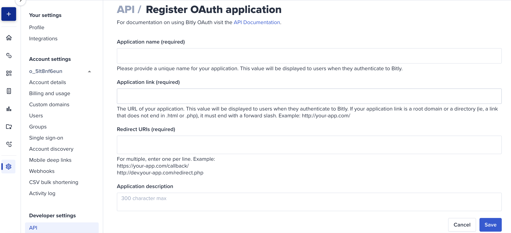
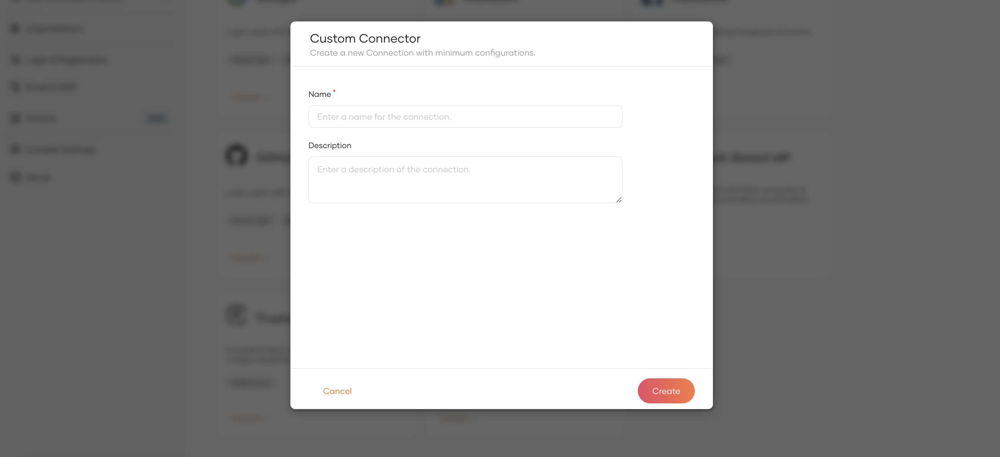
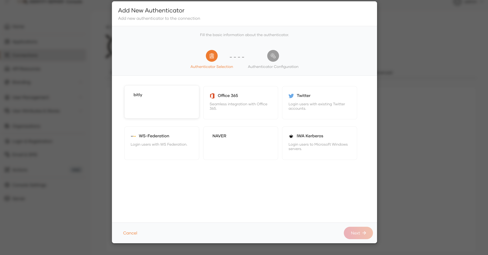
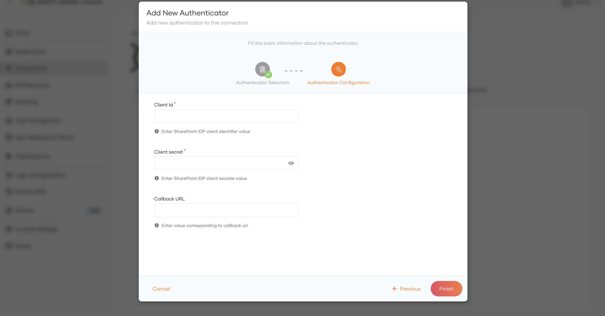

# Configuring Bitly Authenticator In Identity Server 

This guide provides instructions on how to configure the Bitly authenticator and add Bitly login to your applications using WSO2 Identity Server, enabling users to log in with their Bitly accounts.

> For WSO2 Identity Server versions prior to 7.0.0, please refer this [documentation](../README.md) for the configuration process applicable to those earlier releases.

Follow the steps given below to set this up.

## Configure the Bitly Authenticator

1. Download the .jar file from the [WSO2 Store](https://store.wso2.com/connector/identity-outbound-auth-bitly)

2. Place the jar file into the
   `<IS_HOME>/repository/components/dropins` directory.

3. Start or restart the WSO2 Identity Server.

## Register WSO2 Identity Server on Bitly

1. Navigate to Bitly [Create an app page](https://app.bitly.com/settings/api).

2. Enter the required details.
    * Application name.
    * Application link.
    * Redirect URIs (Callback URIs. The default redirect URL in WSO2 Identity Server is `https://localhost:9443/commonauth`.).
3. Click on **Save**. You will be redirected to the  **Settings** page of the created application.

4. Copy the **Client ID** and **Client Secret** from the page.

## Register the Bitly IdP

Next, let's register the Bitly IdP in WSO2 Identity Server.

1. On the WSO2 Identity Server Console, go to **Connections**.

2. Click **Create Connection** and select Custom Connector.

3. Enter a unique name and a description and click Create.

4. Go to **Settings** tab and click **New Authenticator**.

5. Select the **Bitly** authenticator you want to add and click Next.

6. Enter the requested details of the authenticator and click Finish.

<table>
<thead>
<tr class="header">
<th>Parameter</th>
<th>Description</th>
</tr>
</thead>
<tbody>
<tr class="odd">
<td>Client Id</td>
<td>The client ID obtained from Bitly app.</td>
</tr>
<tr class="odd">
<td>Client Secret</td>
<td>The client secret obtained from Bitly app.</td>
</tr>
<tr class="odd">
<td>Callback URL</td>
<td>This is the URL to which the browser should be redirected after the authentication is successful. 
It should have this format: https://(host-name):(port)/commonauth</td>
</tr>
</tbody>
</table>

## Enable Bitly login

> You need to [register an application with WSO2 Identity Server](https://is.docs.wso2.com/en/latest/guides/applications/). You can register your own application or use one of the [sample applications](https://is.docs.wso2.com/en/latest/get-started/try-samples/) provided.

1. On the WSO2 Identity Server Console, go to **Applications**.
2. Select your application, go to the Login Flow tab and add Bitly login from your preferred editor:

   a. Click Add Sign In Option to add a new authenticator to the first step.

   b. Select the Bitly connection.

   c. Click Confirm to add login with Bitly to the sign-in flow.

3. Click Update to save your changes.

## Try it out

Follow the steps given below.

1. Access the application URL.

2. Click Login to open the WSO2 Identity Server login page.

3. On the WSO2 Identity Server login page, Sign in with Bitly.

4. Log in to Bitly with an existing user account.